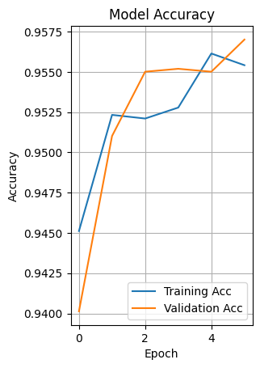
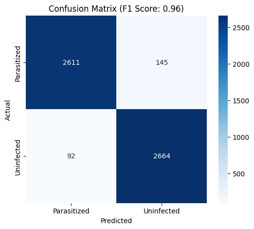
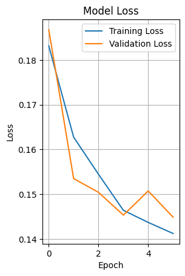

# 🩺 Malaria Cell Detection AI: Medical Diagnosis using Deep Learning


> **95.70% Accuracy** | **0.96 F1-Score** | **Real-time Inference**

## 📖 Project Overview
This project implements a **Convolutional Neural Network (CNN)** to automate the detection of Malaria in microscopic blood smear images. Malaria diagnosis typically requires tedious manual examination by pathologists. This AI solution automates the process, classifying cells as **Parasitized** or **Uninfected** with high precision, potentially reducing diagnosis time and human error.

This system was built using the **NIH Malaria Dataset** and demonstrates a complete Deep Learning pipeline from data preprocessing to model deployment.

## 🚀 Key Features
* **Medical-Grade Accuracy:** Achieved **95.70% Validation Accuracy** and **0.96 F1-Score**.
* **Advanced Preprocessing:** Automated resizing, normalization, and data augmentation pipeline.
* **Robust Architecture:** Custom CNN with Dropout regularization to prevent overfitting.
* **Evaluation Metrics:** Includes Confusion Matrix and detailed Classification Reports.
* **Deployment Ready:** The trained model is saved in the `models/` directory (`.h5` format) for easy integration into web/mobile apps.

## 📊 Performance & Results
The model was trained for 6 epochs on the NIH Malaria Dataset.

| Metric | Score |
| :--- | :--- |
| **Validation Accuracy** | **95.70%** |
| **F1-Score** | **0.96** |
| **Training Loss** | 0.13 |

### Visualizations
**1. Model Accuracy & Loss**
> The training and validation curves track closely, indicating no overfitting.


**2. Confusion Matrix**
> High True Positives and True Negatives show strong class separation.


**3. Predictions**
> Real-time inference on unseen validation data.


## 🛠️ Tech Stack
* **Core:** Python, TensorFlow, Keras
* **Data Processing:** TensorFlow Datasets (TFDS), NumPy
* **Visualization:** Matplotlib, Seaborn
* **Environment:** Google Colab / Jupyter Notebook

## 📂 Dataset
The project uses the official **NIH Malaria Dataset** containing 27,558 cell images.
* **Source:** [TensorFlow Datasets](https://www.tensorflow.org/datasets/catalog/malaria)
* **Classes:** Parasitized vs. Uninfected

## 🧠 Pre-trained Model
The trained model weights are available in the `models` directory.
* **File:** `models/malaria_cnn.h5`
* **Use Case:** Load this file directly to skip training and perform immediate inference.

## ⚡ How to Run
1.  **Clone the Repository**
    ```bash
    git clone [https://github.com/zyna-b/Malaria-Cell-Detection-AI.git](https://github.com/zyna-b/Malaria-Cell-Detection-AI.git)
    cd Malaria-Cell-Detection-AI
    ```

2.  **Install Dependencies**
    ```bash
    pip install tensorflow tensorflow-datasets matplotlib seaborn numpy scikit-learn
    ```

3.  **Run the Notebook**
    Open `Malaria_Detection_CNN.ipynb` in Jupyter or Google Colab and run all cells. The dataset will download automatically.

## 🔮 Future Scope
* **Mobile App Integration:** Deploying the `.h5` model to a Flutter/React Native app for field diagnosis.
* **Transfer Learning:** Experimenting with VGG19 or ResNet50 for potentially higher accuracy.
* **Explainable AI (XAI):** Implementing Grad-CAM to visualize *where* the model looks inside the cell.

---
**Author:** Zainab Hamid  
*Founder, Ctrl. Alt. Delta | AI Engineer* [LinkedIn](https://www.linkedin.com/in/zainab-hamid-187a18321/)
